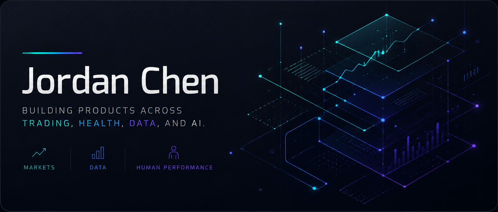

  

  
  

I build products from problems I've experienced firsthand, primarily across
trading, health, data, and AI.

## Featured Projects

### EdgeBoard

A trading performance, journaling, and review platform built from years of
discretionary NQ trading.

  
  

### SOMA

A connected training and health platform inspired by my experience coaching
clients.

  
  

## Background

My background spans markets, data analytics, and human performance. I use
AI-assisted development to turn domain knowledge into practical software and
iterate quickly from real-world feedback.

## Tools & Platforms

  
  
  
  
  
  
  
  
  
  

